# Arquitectura Agéntica de Termimate

Descripción técnica completa del sistema de agente IA: cómo fluyen los datos desde que el usuario escribe un mensaje hasta que aparece la respuesta en pantalla.

---

## 1. Visión General de Capas

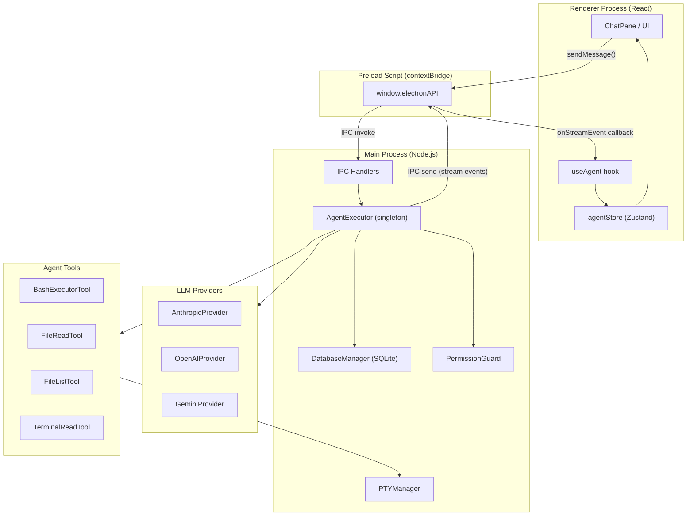

---

## 2. Flujo Completo de un Mensaje

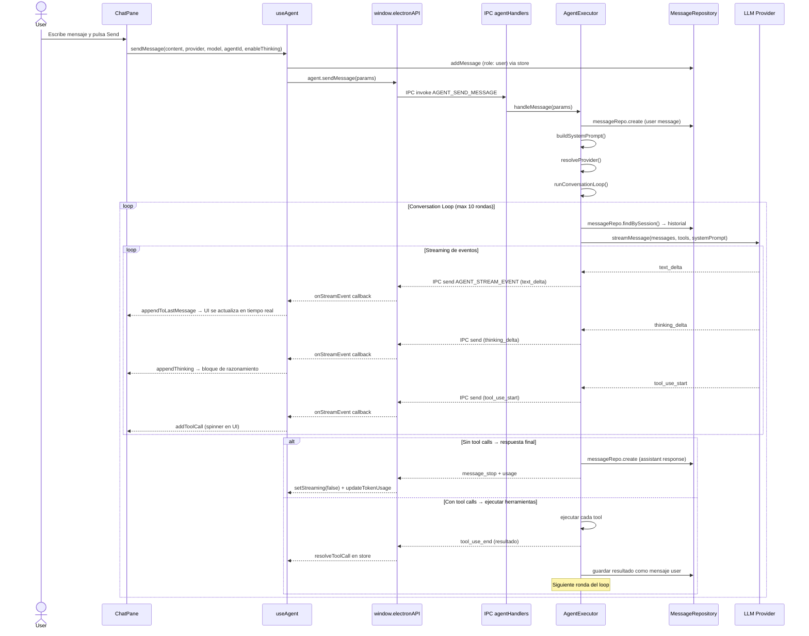

---

## 3. Pipeline de Streaming por Proveedor

Los tres proveedores exponen la misma interfaz `AsyncIterable<StreamEvent>` pero con implementaciones distintas:

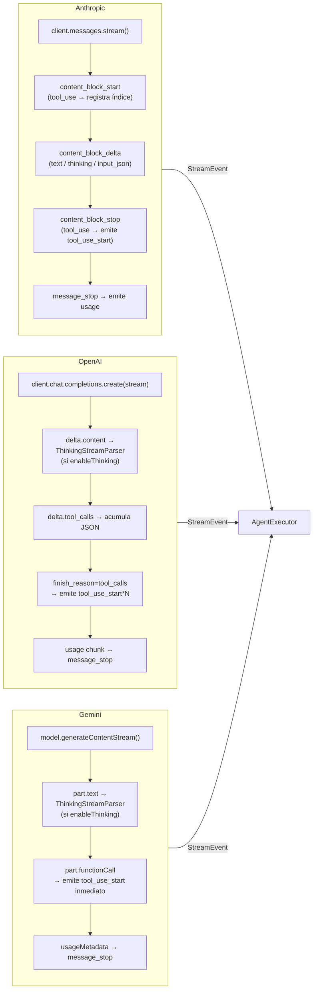

### ThinkingStreamParser (OpenAI / Gemini)

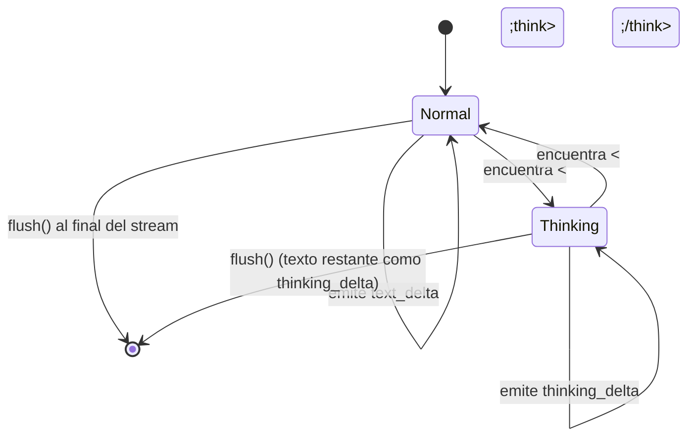

---

## 4. Bucle Agéntico (Conversation Loop)

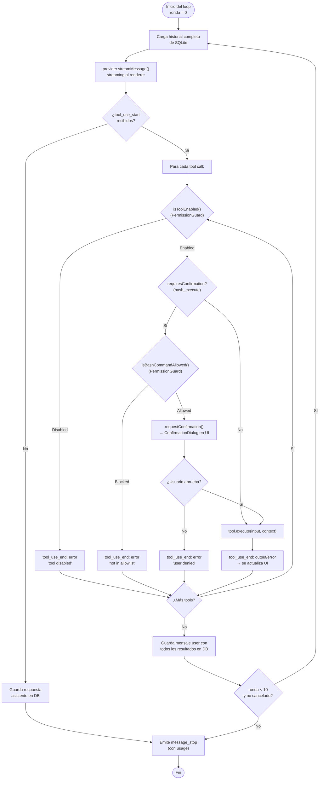

---

## 5. Seguridad y Permisos

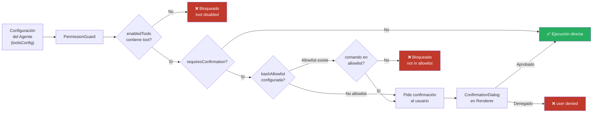

---

## 6. Estado en el Renderer (Zustand Store)

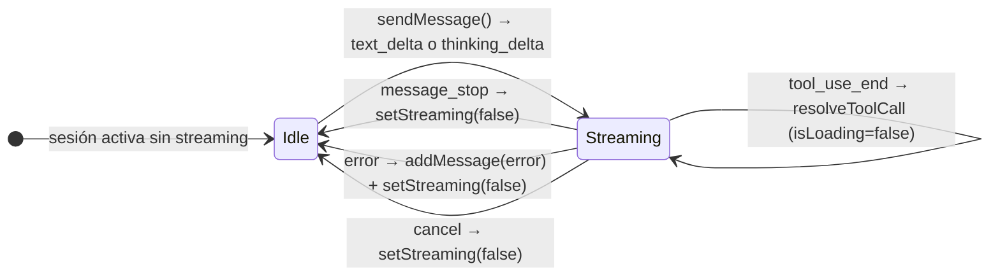

### Estructura del ChatMessage en store

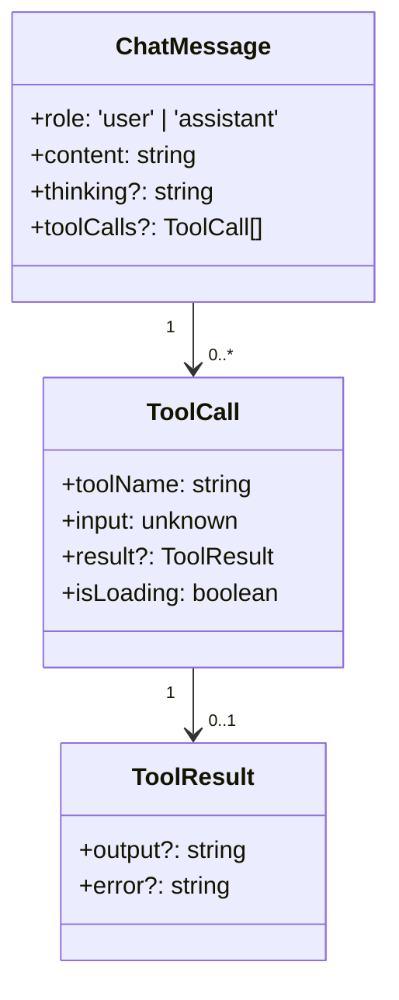

---

## 7. IPC: Canales de Comunicación

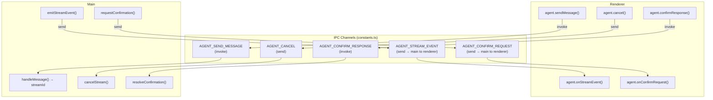

---

## 8. Persistencia (SQLite)

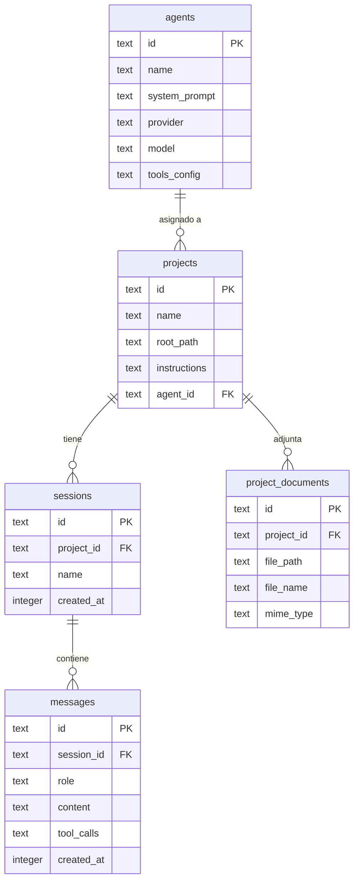

> **Nota:** `tool_calls` y `tools_config` se serializan como JSON dentro de columnas `TEXT`. El historial de conversación que se envía al LLM se reconstruye en cada ronda del loop aplanando `messages.content` (sin tool calls) para mantener compatibilidad entre proveedores.

---

## 9. Construcción del System Prompt

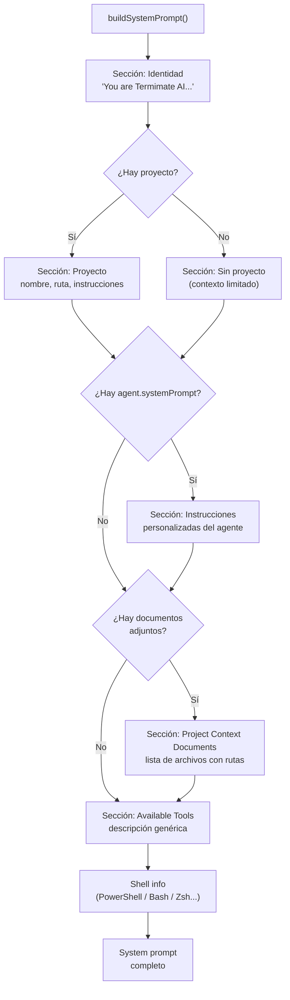
